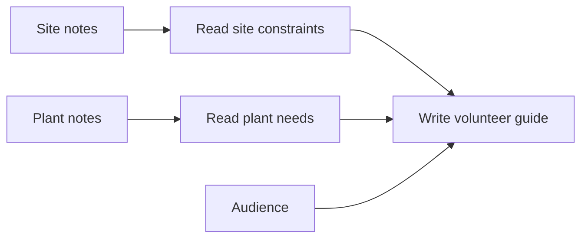

# Lamina

[**Explore the examples**](https://fadibahodi.github.io/lamina/) · [Run locally](#run-lamina-locally) · [Reusable methods](docs/methods.md) · [Design constraints](docs/design-constraints.md) · [Measurement](docs/measurement.md)

**Turn source material into useful work. Keep the method that made it.**

Lamina is an open engine and local app for turning documents into connected guides, decision practice, teaching scripts, and reusable production methods. A model does the interpretation and writing. Lamina coordinates the work, carries evidence between steps, remembers completed results, and makes changes inspectable.


Start with the [interactive example](https://fadibahodi.github.io/lamina/). Read a source passage about worker leases, inspect the illustrated explanation it supports, then try an incident that changes as new evidence arrives. Download the guide as PDF or Markdown. The example is original, curated material: it demonstrates the product and its execution contract, not model performance on unseen documents.

## What someone can do with it

| Starting point | Result |
| --- | --- |
| A collection of overlapping notes | A connected guide with source passages, explicit deferrals, and practice suited to the material |
| A source-backed operational problem | Progressive decision questions, answer limits, and a separate marking sheet |
| A process worth reusing | An importable method defining the jobs, their dependencies, worker context, and resource limits |
| A changed source or instruction | A new run that can reuse unchanged work, with a record of what executed again |
| An observation about what worked or failed | A local, scoped experience record that a later operator or agent can retrieve |

The browser runs the document-to-guide pipeline. The command line also runs custom method graphs. Both use your configured adapter; importing a method does not install code or choose a model service. The public site is a read-only example and procedure editor. To process your documents, run the local app.

## Run Lamina locally

Requires Python 3.11 or newer.

```bash
git clone https://github.com/FadiBahodi/lamina.git
cd lamina
python3 -m venv .venv
source .venv/bin/activate
python -m pip install -e '.[pdf]'
lamina app --workspace .lamina --port 8048
```

Open `http://127.0.0.1:8048`. On Windows, activate with `.venv\Scripts\activate`. The app includes the offline example. Enable generation with an adapter configured as described in [Adapters](docs/adapters.md):

```bash
lamina app --workspace .lamina --port 8048 \
  --adapter 'python examples/adapter/http_chat.py'
```

Endpoint, model, credentials, and executable selection stay in local process configuration. `lamina studio` remains an alias for compatibility. See [operating modes](docs/procedures.md) for import and output details.

## Give a new agent a method it can run

A method explains when it applies and defines a graph of jobs. Each job has instructions, a resource lane, explicit prerequisites, and selected task fields. A writer can receive the completed work it depends on without inheriting every unrelated source or another worker's unfinished output.



Run the small, offline mechanism demonstration:

```bash
python examples/methods/demo.py
lamina method validate examples/methods/field-guide.json
```

It executes two independent readings and a dependent guide. Changing only the site notes reuses the plant reading and reruns the affected work. A different task uses the same method. The adapter in this example is a deterministic fixture; no account or model call is needed.

For real generation, provide a task JSON object and your adapter:

```bash
lamina method run --method examples/methods/field-guide.json \
  --task my-visit.json --workspace .lamina \
  --adapter 'python examples/adapter/http_chat.py' --output run.json
lamina method experience --family field-guides --workspace .lamina
```

[Methods and memory](docs/methods.md) defines the task schema, recording observations, cache behavior, and failure recovery. Selection and revision are currently explicit operator or agent decisions. Lamina does not automatically turn a critique into a new rule or claim that retained text is learned expertise.

## The engineering underneath

**Dependencies govern parallelism.** Ready jobs execute within global worker and per-lane concurrency limits. Synthesis waits for its prerequisites. A failed dependency blocks its descendants while independent work can finish.

**Context is an explicit input.** Custom jobs receive selected task fields and direct prerequisite results. Guide authors receive a shared lesson route and exact prerequisite evidence. That is planned context; it is not a claim that every writer has read the other writers' finished prose.

**Reuse follows meaning, not just a version label.** Custom-node cache identity includes instructions, selected task data, dependency results, runtime revision, and adapter identity. Changing an unrelated branch or the method's descriptive version does not discard valid cached work. Change the adapter revision when its model or configuration changes.

**Evidence checks have a defined scope.** The guide pipeline tracks source units, reconciled ideas, assignments, and exact quotations. Its validators reject missing memberships and invented quotes. They do not prove that every important idea was extracted or that an interpretation is true. Generic method jobs return JSON objects; domain validation must be supplied by the adapter or a dependent job.

**Experience stays inspectable.** SQLite stores completed node results, final run receipts, and explicitly recorded observations. Receipts report executed/cached/failed/skipped nodes, context bytes, and elapsed time. There is no claim of automatic method selection, distributed scheduling, token billing, or autonomous improvement.

For total service work \(W\), longest dependency path \(D\), and \(p\) workers, an ideal lower bound is:

$$T \geq \max(W/p, D)$$

More workers cannot remove a serial dependency. With separate resource lanes, lane demand and capacity impose additional bounds. Real latency also includes queues, provider limits, retries, and review. [Design constraints](docs/design-constraints.md) develops the cost, context, and repair model; [Measurement](docs/measurement.md) defines how to evaluate it. These equations are accounting tools, not measured speed claims.

## Build and export from the command line

```bash
lamina ingest ./notes --workspace .lamina
lamina ingest ./held-out-questions.md --workspace .lamina --role assessment
lamina search 'worker leases' --workspace .lamina
lamina build --workspace .lamina \
  --adapter 'python examples/adapter/http_chat.py' --output ./site
lamina export ./site/bundle.json --format pdf --output ./guide.pdf
lamina export ./site/bundle.json --format markdown --output ./guide.md
```

Markdown and text are supported directly; PDF text extraction and PDF export require the optional PDF dependencies. Scanned pages need OCR outside this release. Assessment sources are held out of authoring and public export. Listen output is a script, with optional browser speech; synthesized podcasts and audio delivery QA are not included.

For an entirely offline guide build, use `lamina demo --output ./demo --pdf`, then `lamina serve ./demo --port 8000`. This uses the repository's curated engineering fixture.

## What we intend to measure

Parallel agents, citations, and reusable skills already exist elsewhere. Lamina's question is more specific: **can an unfamiliar operator reuse a production method, understand its editorial decisions, and repair a local defect with less repeated work at comparable quality?**

The [comparison](docs/comparison.md) records existing capabilities in Manus, NotebookLM, and graph runtimes. The [evaluation plan](docs/evaluation.md) separates structural checks from content quality and learning outcomes. The [systems benchmark](docs/benchmarks.md) measures local cache and queue mechanics with synthetic work. No quality-matched competitive benchmark has been completed.

The current scheduler is local, and the guide's global reconciliation and planning still have whole-collection context limits. Active browser-run tracking is in memory; durable stage results survive restart, but the browser does not automatically resume an interrupted run. A custom graph's final receipt is written when the run finishes; an interrupted process can rerun and reuse committed nodes. These boundaries matter when taking a useful prototype to scale.

## Development

```bash
python -m pip install -e '.[pdf,test]'
python -m pytest tests -q
```

Tests cover evidence ownership, held-out sources, cache concurrency, failure recovery, selective invalidation, dependency context, method validation, and artifact generation. [CI](https://github.com/FadiBahodi/lamina/actions/workflows/ci.yml) runs Python 3.11–3.13 without credentials.

Created by **Fadi Bahodi**. Released under the [MIT License](LICENSE).
