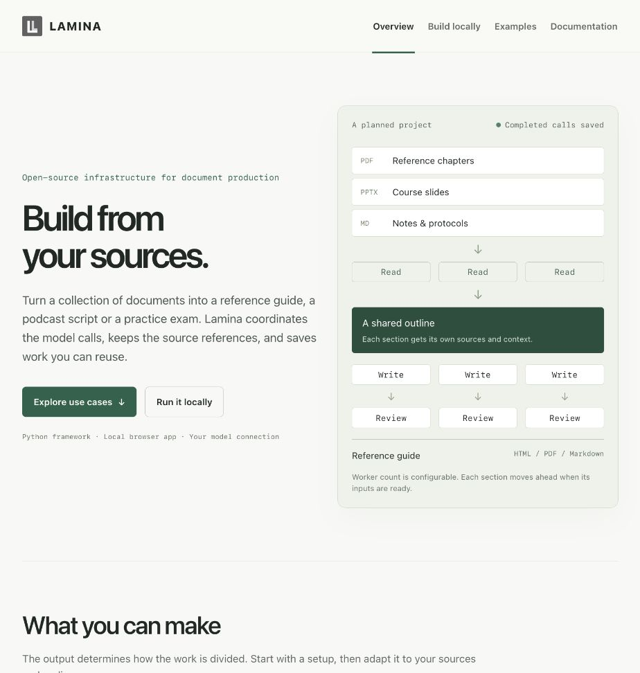

# Lamina

[Live site](https://fadibahodi.github.io/lamina/) · [Download](https://github.com/FadiBahodi/lamina/releases/latest) · [Documentation](docs/production.md)

Lamina turns a collection of source files into a reference guide, podcast script or practice exam. Give it the files and describe what you want to make. Lamina divides the work into model calls that fit, gives each call the right source material and assembles the result with citations and an execution receipt.

| What you can make | Example |
| --- | --- |
| Reference guide | Combine chapters, slides and notes into an on-call handbook organized around the questions people need answered. |
| Podcast script | Plan a teaching route through dense material, then let several writers develop its sections. Add a speech adapter to produce WAV audio. |
| Practice exam | Build candidate questions and a separate marking guide, then have a blind solver attempt each question before another call judges the answer. |

Lamina can plan the sections, write directly from a small collection or follow supplied assignments. Models decide what the sources mean, which ideas belong together and how to explain them. Lamina manages source identity, passage ownership, context, dependencies, concurrent work, saved results and cache reuse.



## Try it locally

Python 3.11+ and SQLite with FTS5 are required.

```sh
git clone https://github.com/FadiBahodi/lamina.git
cd lamina
pip install -e '.[pdf,slides,http,tokens]'
lamina app --workspace .lamina
```

Open `http://127.0.0.1:8048`. With no model adapter, the app offers a recorded project you can inspect from source reading through section revision. You can also run a deterministic guide fixture offline with `lamina demo --output demo`.

To process your own files, configure a compatible chat endpoint in `models.json`, then start the app with:

```sh
lamina app --workspace .lamina --adapter @models.json
```

The [adapter guide](docs/adapters.md) includes the file format, HTTP example, tokenizer and context settings, and workload limits. Test those limits on representative material; a request that fits can still produce incomplete work.

## How a planned project works

1. Lamina imports Markdown blocks, text paragraphs, PDF pages and PowerPoint slide components while retaining their source locations. Scanned PDFs can use local OCR.
2. Readers own separate source structures and can ask for nearby context when a boundary cuts across a list or qualification. Each extracted idea points back to exact source text.
3. A planner groups related ideas across files, builds a shared outline and gives every idea a section owner or an explicit reason for omission.
4. Writers receive their assignments, original source passages, relevant shared relationships and the immediate neighboring sections. Independent sections run together. Work that needs a completed result can declare that dependency in a custom workflow.
5. Review begins when a section finishes. A concrete finding can trigger one repair and recheck. Lamina exports Markdown, HTML, PDF and a receipt that records findings, request sizes, source coverage, timing and cache outcomes.

Automatic mode sends a small collection straight to a writer and uses planning when the declared limits require it. You can also choose a route or provide the section assignments. Reading, writing and review share a configurable worker limit. More workers help when several calls are ready; they do not shorten planning or a dependency chain.

Cache keys include the request's semantic inputs and adapter identity. Restarting reuses completed calls. A section revision reruns affected requests and keeps matching results. Reusable reading can save an inventory for later projects, although its omissions will also be reused.

For other jobs, the [method runtime](docs/methods.md) executes a declared graph with completed-result dependencies and resource lanes. It reuses Lamina's scheduling, persistence and cache outside the document planner.

## Limits

Source IDs and quotation matches establish where material came from. They do not prove that extraction was complete, a citation supports the claim or the finished artifact is accurate and useful. Evaluate the chosen model, workload and output on the material that matters.

A PDF page, slide or required context set can exceed the configured limits. PDF reading order and figures need inspection; OCR supplies text but does not provide general visual interpretation. Assessments are exported candidate and examiner files, not live oral examinations. Audio support synthesizes the whole podcast script and checks the WAV structure and duration, but it does not listen for pronunciation, pacing, fidelity or educational quality.

Lamina runs declared production routes and custom graphs. It does not invent methods, train itself or choose a method autonomously. Keep the local app on loopback because project identifiers are not authentication tokens.

The [production guide](docs/production.md) documents workflows, controls, revision and recovery. See [parsing](docs/parsing.md) for file handling, [quality evaluation](docs/quality-evaluation.md) for live model experiments and [architecture](docs/architecture.md) for scheduling details.

```sh
pip install -e '.[test,pdf,slides,http,tokens]'
python -m pytest -q
```
