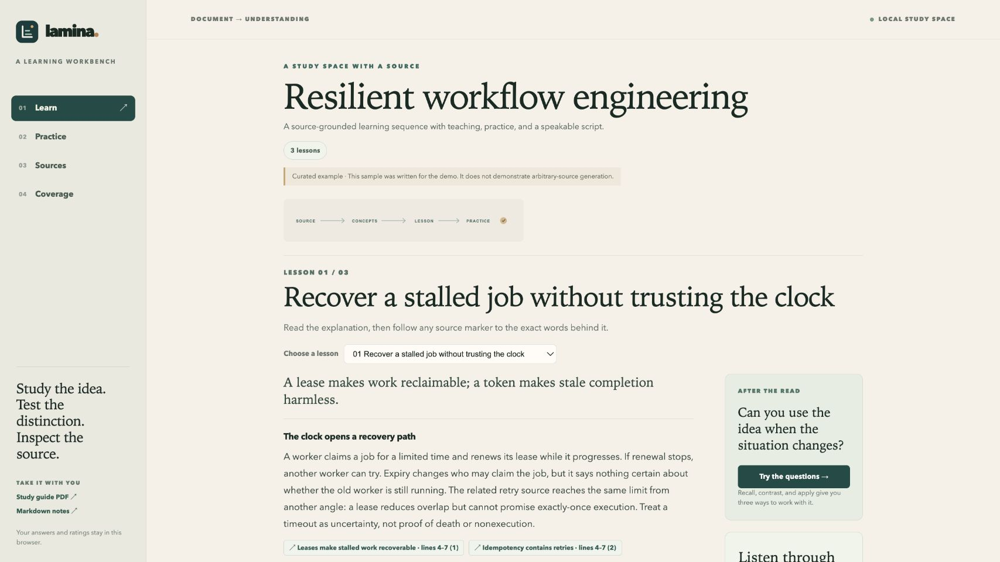
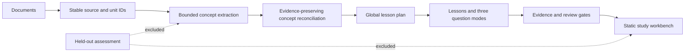

# Lamina

[**Live workbench**](https://fadibahodi.github.io/lamina/) · [Architecture](docs/architecture.md) · [Bring your own model](docs/adapters.md) · [MIT license](LICENSE)

**From documents to a study system you can inspect.** Lamina extracts source-grounded ideas, consolidates overlaps, plans a learning route, and produces lessons, recall/contrast/apply practice, local cases, listen scripts, and printable handouts. The same validated bundle powers each output.



Lamina separates the jobs that often get blurred together. Code owns source identity, cache keys, coverage accounting, evidence checks, and export. A configured content adapter interprets the material and reviews the result. You can follow a generated claim back to an exact source passage.

## Try the offline demo

Requires Python 3.11 or newer. The demo uses a small original field guide bundled with this repository; it does not call a model or require an account.

```bash
git clone https://github.com/FadiBahodi/lamina.git
cd lamina
python3 -m venv .venv
source .venv/bin/activate
python -m pip install -e .
lamina demo --output ./demo
lamina serve ./demo --port 8000
```

Open `http://127.0.0.1:8000`. The export also opens directly from `demo/index.html` without a server. The demo is a curated fixture that exercises the workbench and the build contract, not evidence that arbitrary documents can be authored offline.

For the PDF edition, install `.[pdf]` and add `--pdf` to `lamina demo`. The [hosted example](https://fadibahodi.github.io/lamina/) includes both PDF and Markdown downloads. On Windows, activate the environment with `.venv\Scripts\activate`.

## Build from your own documents

Lamina accepts UTF-8 Markdown and text files. PDF text extraction is available with the optional PDF dependency. The example below uses the repository's [command adapter](examples/adapter/README.md); configure its endpoint, model, and key as described there before `build`.

```bash
python -m pip install -e '.[pdf]'
lamina ingest ./notes --workspace .lamina
lamina ingest ./held-out-questions.md --workspace .lamina --role assessment
lamina inspect --workspace .lamina
lamina search 'water cycle' --workspace .lamina
lamina build --workspace .lamina --adapter 'python examples/adapter/http_chat.py' --output ./site
lamina export ./site/bundle.json --format markdown --output ./study.md
lamina export ./site/bundle.json --format pdf --output ./study.pdf
```

`build` needs a user-configured JSON command adapter. Its process reads one JSON request from standard input and writes one JSON response to standard output. It can use any model or authoring system you provide; Lamina does not bundle credentials or send documents to a service by itself. See [Adapter protocol](docs/adapters.md) for the stages, schemas, and a starting point.

Markdown export has no extra dependencies. PDF export needs `pip install -e '.[pdf]'`. Both produce a source-linked lesson handout with practice prompts before a separate answer key. They are print artifacts from the same validated bundle; the Listen lane remains a script, with no synthesized audio or audio QA claim.

The `assessment` role holds material out of concept extraction, authoring, and public export.

## How the learning route works



Each lesson has **recall**, **contrast**, and **apply** questions. Recall asks you to reconstruct an idea, contrast asks you to distinguish related ideas, and apply asks you to use one in a new situation. Answers begin hidden. When the source supports it, a local case adds staged findings, a second event, and an examiner discussion checklist. The Listen view presents a script with pauses; browser speech can read it aloud.

The coverage view shows where each canonical concept was assigned or why it was deferred. Exact-quote checks tie claims to allowed source units. See [Architecture](docs/architecture.md) for the validation and recovery model.

## Design choices

- **Source before synthesis.** Stable content hashes and locators make a build traceable and let unchanged work be reused.
- **Concepts before pages.** The planner organizes extracted ideas into a route, with explicit deferrals instead of an unexplained long inventory.
- **Transparent retrieval.** Body BM25, heading matches, and optional supplied vectors contribute explicit ranks to reciprocal-rank fusion.
- **Practice with consequences.** Recall, contrast, and application reveal different gaps; answers stay hidden until the learner chooses to reveal them.
- **Reviewable output.** Evidence links, build counters, and durable stage records make it possible to inspect what happened and what remains uncertain.
- **Portable delivery.** The output is static HTML, CSS, JavaScript, and JSON, with no hosted account required to study it.

## Limits

Structural coverage accounts for extracted ideas; it cannot prove that extraction found everything important or that the interpretation is correct. Review checks the configured rubric and is not independent expert validation by default. Cases run locally on one screen, with no synchronized remote session or exam-score claim. Browser speech reads a script; Lamina does not generate or audit audio. Local self-ratings are study notes, without calibrated spaced repetition or mastery prediction. PDF ingestion is text extraction, so scanned pages need OCR first. The command adapter accepts at most 2 MB per request by default, and builds use 1–32 local workers; global reconciliation and planning still have whole-corpus context limits.

Lamina was created by **Fadi Bahodi**. It is released under the [MIT License](LICENSE). Contributions that improve source handling, accessibility, validation, or honest measurement are welcome.

## Development

```bash
python -m pip install -e '.[pdf]'
python -m unittest discover -s tests -v
```

The test suite exercises failure recovery, concurrent cache claims, source holdout, evidence-conserving merges, malformed exports, adapter requests, and clean end-to-end artifact generation. [CI](https://github.com/FadiBahodi/lamina/actions/workflows/ci.yml) checks Python 3.11–3.13. No credentials are required to run the tests.
