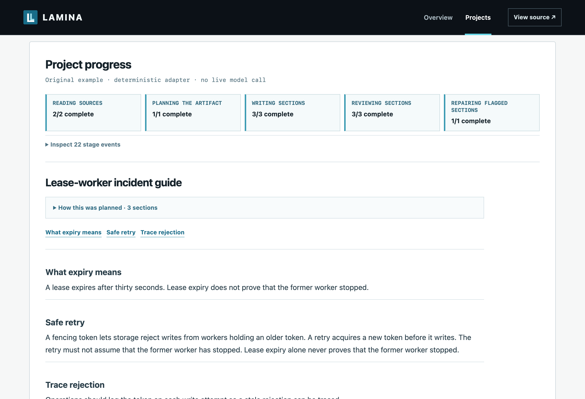

# Lamina

[Live site](https://fadibahodi.github.io/lamina/) · [Download](https://github.com/FadiBahodi/lamina/releases/latest) · [Documentation](docs/production.md)

Lamina turns a pile of source files into something you can study from: a flashcard deck, a reference guide, a podcast with audio, or a practice exam. You give it the files and say what you want. It splits the reading across many model calls at once, keeps every claim tied to the exact passage it came from, and hands back the result with a receipt that shows what was read, what was written, and what still needs a human look.

| What you can make | How it is built |
| --- | --- |
| Flashcards (`cards`) | The sweep route. Every reader window is one independent call that writes cards with citations. Duplicates are removed locally, a sample of windows is audited against its source, and the deck exports straight to Anki. No planner, no writer, no review chain. |
| Reference guide, document | Readers extract ideas, a streaming planner groups them into sections, writers draft each section from its own evidence, reviewers check it, one repair if needed. |
| Podcast script and audio | Same as a guide with a spoken-prose contract. Each section is synthesized the moment it leaves review, so the audio is assembled from cached segments rather than started after the last section. |
| Practice exam | Candidate prompts and a separate marking guide, then a blind solver attempts each question before a judge marks it. |

Models decide what the sources mean, what belongs together and how to explain it. Code decides everything that must not drift: source identity, who owns which passage, what each call can see, how big a request may be, which work runs together, what gets cached, and what the receipt says.



## Try it

Python 3.11+ and SQLite with FTS5.

```sh
git clone https://github.com/FadiBahodi/lamina.git
cd lamina
pip install -e '.[pdf,slides,http,tokens]'
lamina app --workspace .lamina
```

Open `http://127.0.0.1:8048`. Without a model adapter the app shows a recorded project you can click through, and `lamina demo --output demo` builds a deterministic guide offline.

To run on your own files, describe a chat endpoint in `models.json` and start the app with it:

```sh
lamina app --workspace .lamina --adapter @models.json
```

The [adapter guide](docs/adapters.md) has the file format, an HTTP example, the Gemini example with native token counting, and the per-stage workload limits. From the command line:

```sh
lamina ingest --workspace .lamina chapter.pdf slides.pptx
lamina produce --workspace .lamina --adapter @models.json --format cards --brief "Flashcards for the emergency medicine board exam"
lamina produce --workspace .lamina --adapter @models.json --audio-adapter @speech.json --format podcast-script --episode-minutes 25 --brief "A review podcast on the same material"
```

## How a run works

**Reading** runs first and runs wide. The sources are packed into windows that fit the reader's budget. Each window owns its core text and also sees the last few sentences of the previous unit and the first few of the next, so a list or qualification cut by a page break is visible without a second round trip. Readers cite spans by ID; code materializes the exact quotation. A window that fails after its retry is recorded and the run continues on what was read.

**The sweep** (`--format cards`) stops here: readers write the cards, local similarity suppresses near-duplicates, a quarter of the windows (configurable) get one audit call that looks for omissions and unsupported cards, and the deck is exported. Audit findings are attached to the receipt; they never remove a card.

**Planning**, for guides and podcasts, groups the extracted ideas into an outline, and it starts while reading is still running: grouping calls begin on the pages already read. When the ideas do not fit one call, a tree of grouping calls summarizes them, level by level, each level starting as soon as a full batch of the level below exists. The outline sees each group's description plus one original card as an exemplar. For a podcast the outline also divides the sections into episodes of a chosen length and gives each section a spoken-word target. Every original idea is then assigned to exactly one section or explicitly omitted.

**Writing and review** run per section in one shared pool: write, review, one repair, one recheck, with review of one section overlapping writing of another. Writers see their assigned ideas, the original passages, the exact supporting passages those ideas cited, and the titles of neighbouring sections.

**Delivery** exports Markdown, HTML, PDF, a plan and a receipt. Podcasts render to one WAV per episode through a speech adapter, with the full programme beside them; cards export to `cards.tsv` and `cards.json`.

Workers default to 16 and apply across stages. Restarting a run reuses every completed call. Revising one section reruns only the requests that changed.

## Where the time goes

[Flow geometry](docs/flow-geometry.md) models the routes as dependency graphs: how many serial calls sit on the critical path, how many barriers wait on the slowest call of a batch, and which calls can end a run. The sweep is two calls deep. The planned route is deeper and buys an outline for it. The document gives the inequalities and the defaults they led to.

## Limits

Source IDs and span citations prove where a sentence came from, not that extraction was complete or that a card tests the right thing. The sampled audit catches some omissions; it is not a recall measurement. Workload limits are configured, not learned; test them on your own material with `lamina calibrate`. PDF reading order and figures need inspection, and OCR gives text, not visual interpretation. Audio is checked for structure and duration, not for pronunciation or pacing. Keep the local app on loopback: project IDs are not authentication.

## Developing

```sh
pip install -e '.[test,pdf,slides,http,tokens]'
python -m pytest -q
```

[Architecture](docs/architecture.md) covers scheduling, caching and recovery; [production](docs/production.md) covers every route, option and export; [engineering decisions](docs/engineering-decisions.md) records the alternatives considered; [live model results](docs/live-model-evaluation.md) record real runs, including the ones that failed.
