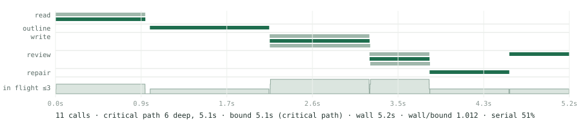

# Lamina

[Website](https://fadibahodi.github.io/lamina/) · [Releases](https://github.com/FadiBahodi/lamina/releases/latest) · [Documentation](docs/README.md)

Lamina is a Python library, command-line tool and local web app for turning source files into flashcards, reference guides, podcast scripts and audio, or practice exams. You supply the files, the goal and a model adapter. Lamina divides the work, runs independent model calls in parallel, preserves source references, and saves results for recovery and revision.

| What you can make | How it is built |
| --- | --- |
| Flashcards (`cards`) | Every reader window is one independent call that writes cards with citations. Duplicates are removed locally, a sample of windows is audited against its source, and the deck exports to Anki. No planner, no writer, no review chain. |
| Reference guide, document | Readers extract ideas, a streaming planner groups them into sections, writers draft each section from its own evidence, reviewers check it, one repair if needed. |
| Podcast script and audio | A guide with a spoken-prose contract and an episode plan. Each section is synthesized the moment it leaves review, so the audio is assembled from cached segments. |
| Practice exam | Candidate prompts and a separate marking guide, then a blind solver attempts each question before a judge marks it. |

Models decide what the sources mean, what belongs together and how to explain it. Code decides everything that must not drift: source identity, who owns which passage, what each call can see, how big a request may be, which work runs together, what gets cached, and what the receipt says.

## What the code enforces

Three invariants hold on every route, and each has a property-based test that searches for a counterexample ([`tests/test_invariants.py`](tests/test_invariants.py)).

**A citation names a span the request rendered.** Sources are split into sentence spans that partition the text exactly; a reader cites span IDs; code materializes the quotation from the stored text. The validator indexes only the spans the request showed, so a citation of a neighbouring sentence that the halo cut off is rejected rather than quietly resolved. A real citation still proves provenance, not entailment; the reviewer and the reader of the document judge that.

**Every extracted idea has one owner or an explicit omission.** The outline assigns each idea to exactly one section or lists it under `omitted`; the plan carries both, and coverage is computed from them, never from the prose.

**Similarity may nominate; it may not delete.** A card leaves a deck only when its normalised text matches a kept card, or when its vector similarity passes the threshold *and* it agrees with the kept card on numbers, negations, capitalised abbreviations, units and word order. "0.1 mg" and "1 mg", "MI" and "GI", "pressure" and "no pressure" score 1.0 under TF-IDF and are kept, listed as related.

## What every receipt measures

Every tracked call records when it started and ended and which calls it waited for. The planner declares the reads that fed each grouping batch and the batches that fed the outline; section chains and audits follow stage rules written in [`geometry.py`](src/lamina/geometry.py). From those records each receipt reports the schedule bound that any run must respect,

$$T \;\ge\; \max\left(\frac{W}{P},\; D\right)$$

with `W` the total model time, `P` the worker limit and `D` the critical path, beside the measured wall `T`, the ratio `T / bound`, the peak and mean calls in flight, the fraction of the span with at most one call running, and the context amplification (bytes sent over distinct source bytes). Exported documents end with the timeline:



This one is `lamina demo --synthetic-latency`: the bundled two-note fixture with a scripted adapter that sleeps a fixed time per stage, so the shape is real and the seconds are not. The receipt says `timing: synthetic`. Eleven calls, critical path six deep (read 0.9 s → outline 1.2 s → write 1.0 s → review 0.6 s → repair 0.8 s → recheck 0.6 s), bound 5.1 s, wall 5.2 s, `wall_over_bound` 1.012. On a live run the same block says whether the hour went to the model or to waiting.

## Install

Requires Python 3.11+ and SQLite with FTS5.

```sh
git clone https://github.com/FadiBahodi/lamina.git
cd lamina
python -m venv .venv
source .venv/bin/activate
pip install -e '.[pdf,slides,http,tokens]'
```

## Connect a model

Generation requires your own model endpoint and credentials. For a chat-completions-compatible endpoint, set its connection details:

```sh
export LAMINA_API_BASE="https://your-provider.example/v1"
export LAMINA_MODEL="your-model"
export LAMINA_API_KEY="your-key"
```

Save this as `models.json` in the repository root:

```json
{
  "default": {
    "transport": "jsonl",
    "command": ["python", "examples/adapter/http_service.py"],
    "request_format": "lamina-chat-1",
    "workload": "starter",
    "version": "my-model-1"
  }
}
```

The [adapter guide](docs/adapters.md) covers other providers, per-stage model selection and request limits. Starter limits are initial settings to evaluate on your material.

## Use it

Start the local app and open `http://127.0.0.1:8048`:

```sh
lamina app --workspace .lamina --adapter @models.json
```

Or ingest files and generate from the CLI:

```sh
lamina ingest --workspace .lamina chapter.pdf slides.pptx
lamina produce --workspace .lamina --adapter @models.json \
  --format guide --brief "An answered reference guide with conditions and exceptions"
```

Use `--format cards` for an Anki-importable deck, `podcast-script` for episodes, or `assessment` for separate candidate and examiner material. Audio also requires a [speech adapter](docs/adapters.md#speech-resources). Document exports include Markdown, HTML and optional PDF, alongside the plan and receipt. See [Production](docs/production.md) for source selection, options, revisions and Python usage.

Without a model, `lamina demo --output demo` runs the production engine on two bundled notes with a scripted adapter and writes the guide, plan and receipt to `demo/`, so you can see the output shape before connecting anything. Model runs use the installed app or CLI; selected source text goes to the configured model service.

## How a run works

**Reading** runs first and wide. Sources are packed into windows that fit the reader's budget. Each window owns its core text and also sees the last few sentences of the previous unit and the first few of the next, so a list or qualification cut by a page break is visible without a second call. Readers cite spans by ID; code materializes the exact quotation. A window that fails after its retry is recorded and the run continues on what was read.

**The sweep** (`--format cards`) stops here: readers write the cards, exact and guarded near-duplicates are removed locally (a pair that differs in a number, negation or abbreviation is kept), a quarter of the windows (configurable) get one audit call that looks for omissions and unsupported cards, and the deck is exported as an Anki text file with note types and stable GUIDs. Audit findings are attached to the receipt; they never remove a card. The deck is `ready` only when every window was read and no finding is open.

**Planning**, for guides and podcasts, groups the extracted ideas into an outline, and it starts while reading is still running. When the ideas do not fit one call, a tree of grouping calls summarizes them level by level, each level starting as soon as a full batch of the level below exists. For a podcast the outline also divides the sections into episodes of a chosen length. Every original idea is then assigned to exactly one section or explicitly omitted.

**Writing and review** run per section in one shared pool: write, review, one repair, one recheck, with review of one section overlapping writing of another. Writers see their assigned ideas, the original passages those ideas cited, and the titles of neighbouring sections. Valid sections from a grouped request proceed while their siblings retry.

**Delivery** exports Markdown, HTML, PDF, a plan and a receipt. Podcasts render to one WAV per episode through a speech adapter; cards export to `cards.tsv` and `cards.json`. Workers default to 16 across stages. Restarting a run reuses every completed call; revising one section reruns only the requests that changed.

[Flow geometry](docs/flow-geometry.md) derives the bound above and the defaults from it: why the sweep is two calls deep, why the halo is six sentences, why a failed window is recorded rather than fatal, and what a grouped request costs.

## How the code fits together

- [`source_reading.py`](src/lamina/source_reading.py) reads bounded original passages and preserves exact source references.
- [`planning.py`](src/lamina/planning.py) groups material and assigns it to sections; [`production.py`](src/lamina/production.py) runs writing and review.
- [`execution.py`](src/lamina/execution.py), [`call_runtime.py`](src/lamina/call_runtime.py) and [`store.py`](src/lamina/store.py) schedule work, enforce limits and cache validated results.
- [`similarity.py`](src/lamina/similarity.py) nominates related cards and suppresses duplicates under the meaning guard; [`geometry.py`](src/lamina/geometry.py) reconstructs each run's dependency graph, critical path and bound from its records.
- [`evidence_relations.py`](src/lamina/evidence_relations.py) compares related claims and can reopen original material omitted by extraction.
- [`method_runtime.py`](src/lamina/method_runtime.py) runs custom dependency graphs with selected observations from earlier work.

[Architecture](docs/architecture.md) explains these contracts. [Workflow design](docs/workflow-design.md) covers the different needs of references, audio and exams; [system origins](docs/system-origins.md) preserves their history.

## Limits

Models can omit qualifications or misinterpret real citations. Parsing does not reliably interpret figures, and generated audio needs listening review. Workload settings and cached results do not establish quality. Assessments are exported materials; live oral-case administration requires a separate application. Custom methods execute declared workflows and reuse selected observations without automatically discovering better methods. [Capability status](docs/architecture-status.md) lists the remaining limits; [live model results](docs/live-model-evaluation.md) records measured successes and failures.

## Contribute

```sh
pip install -e '.[test,pdf,slides,http,tokens]'
python -m pytest -q
```

Keep source permissions, exact evidence, independent scheduling and recovery intact when changing a workflow. See [AGENTS.md](AGENTS.md) for repository conventions.
