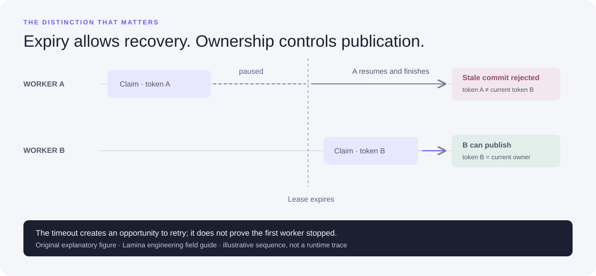

# An open workspace for knowledge production

Lamina turns a source collection and a reusable production procedure into inspectable learning material. The first product audience is educators, training teams, and developers who need to repeatedly transform complex source collections into lessons and assessments, and need control over how that transformation happens.

The product demonstration should answer four questions in one connected journey:

1. **What went in?** Open the original material, its role, and its accepted text.
2. **What procedure was applied?** Inspect and edit the audience, authoring instructions, output selection, and concurrency. Export the procedure as a portable JSON file.
3. **What came out?** Read the guide, answer a short-answer management problem, inspect an examiner sheet, or follow an audio script.
4. **Why this answer?** Follow an output to the exact source passages and inspect the consolidation and assignment decisions.

## A concrete example

The original public engineering collection explains leases, idempotency, and evidence. Two passages make a related point: lease expiry permits recovery, but cannot prove the earlier worker stopped. The engine retains both source passages when consolidating that idea. The study guide explains the distinction. A SAMP-style incident assessment asks the learner what to do when an old worker finishes after its replacement. Subsequent information changes the decision. The examiner sheet supplies independent marking points, answer limits, and source evidence.

The same source collection can therefore support explanation, retrieval, decision-making, and inspection without treating those experiences as interchangeable. The public example is curated and explicitly labelled; it is not a demonstration of automatic generation from arbitrary uploads.

The figure is an original explanatory asset. It does not imply that the current ingestion engine can interpret arbitrary diagrams.

## The reusable unit is a procedure

A procedure describes an audience, authoring instructions, selected output types, and worker width. The installed engine supplies the execution stages and validation contracts. Imported procedures cannot supply executable commands, credentials, or arbitrary filesystem destinations. A user's local adapter is configured separately when starting the application.

This is intentionally narrower than a general workflow language. The current procedure cannot invent a new stage type or wire an arbitrary graph. Its settings condition the supported pipeline, enter cache identity, and travel with the run. A future stage/plugin interface needs versioned contracts, declared inputs/outputs, and controlled execution before a visual canvas can honestly promise arbitrary composition.

## Two operating modes

The public Studio is an interactive example and procedure editor. Files selected there are inspected locally in the browser; they are not sent to a generation service. Generation requires the local engine with an explicitly configured adapter. The local Studio uses the same interface, stores imported material in the selected workspace, starts real runs, and exposes completed artifacts.

Static hosting makes the walkthrough easy to share. A loopback-only local service keeps adapter configuration outside browser files and gives users control of the runtime. A model adapter may send source material to its configured service; local application hosting does not by itself imply offline inference.

## Positioning and competitive boundaries

NotebookLM already offers source-grounded study features, including reports, quizzes, audio and visual outputs. Google documents [flashcards, quizzes and reports](https://workspaceupdates.googleblog.com/2025/09/flashcards-quizzes-reports-notebook-lm-google-education.html), [slide decks, infographics and video overviews](https://blog.google/innovation-and-ai/products/notebooklm/notebooklm-google-io-2026/), and [structured data tables](https://blog.google/innovation-and-ai/models-and-research/google-labs/notebooklm-data-tables/). These official pages were checked on 21 September 2026; capabilities and availability can change.

Lamina's intended differentiation is a portable, inspectable production process: editable procedures, a user-selected content adapter, explicit intermediate representations, source-bound validation, self-hosted execution, and reusable exports. The repository exposes that machinery for modification. This is a product direction, not a claim of feature parity, superior output quality, lower cost, or a capability absent from every competitor.

The strongest initial use case is repeatable source-to-training production. Wider research synthesis and organizational knowledge workflows could use the same mechanisms, but they should be validated as separate applications rather than advertised through empty output tiles.

## Evidence of a useful product

The next user test should ask an unfamiliar educator to import a small collection, adapt a procedure, produce material, find an unsupported or omitted answer, repair the source/instructions, and rerun it. Measure time to the first usable artifact, successful corrections, cost per accepted output, and which intermediate views they actually use. Compare against their existing authoring process on the same collection.

For the technical evaluation, see [design alternatives](design.md), [quality evaluation](evaluation.md), and the [systems benchmark](benchmarks.md). A smooth demo establishes an understandable interaction. Product demand, reliable arbitrary-source generation, and learning effectiveness require different evidence.
